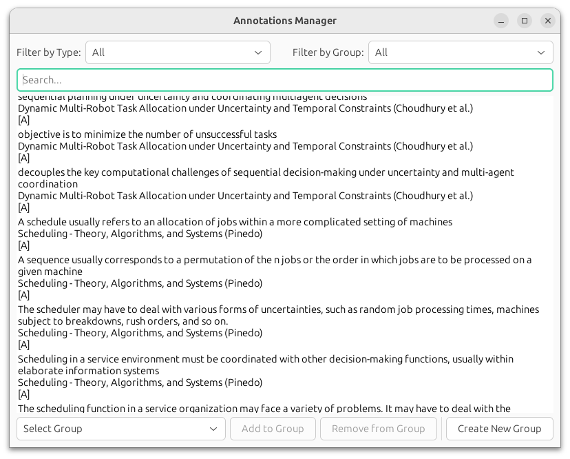
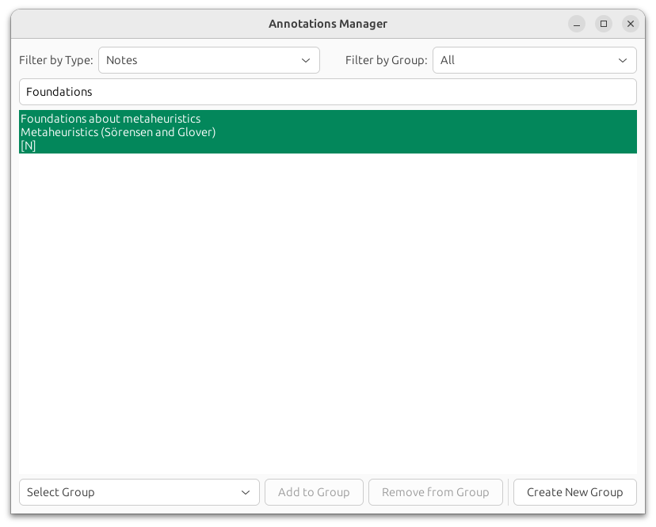

# AnnotationsViewer

View the annotations and notes made in all items in a Zotero library at once.

*System Requirements:*
- A recent python version and GTK 4 support
- On a recent Ubuntu version you should be good to go 
- On macOS you can run `brew install gtk+4 pygobject3` if you have installed python with homebrew

## Usage

Run `python main.py` and follow the instructions.

To update the data you can run `python main.py update`.

## Screenshots

